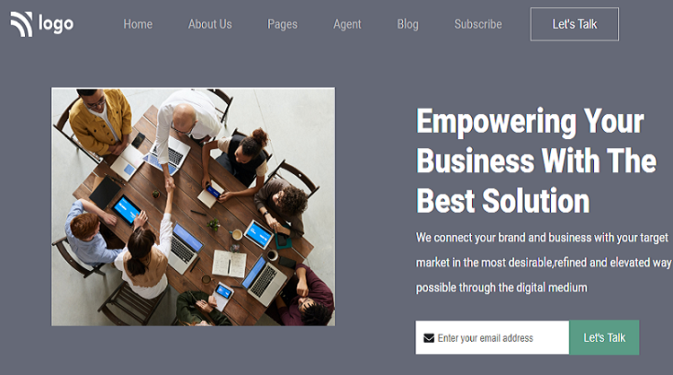

## Live Class Project 12

# Bussiness Landing Page

### Concepts Learnt 
- Creating form with button and its background
- Creating proper header and footer with different background color
- designing differnt banners for responsive webpages.

Time taken to finish this responsive webpage is one and half day

[netlify link](https://live-project-business-homepage.netlify.app/)

